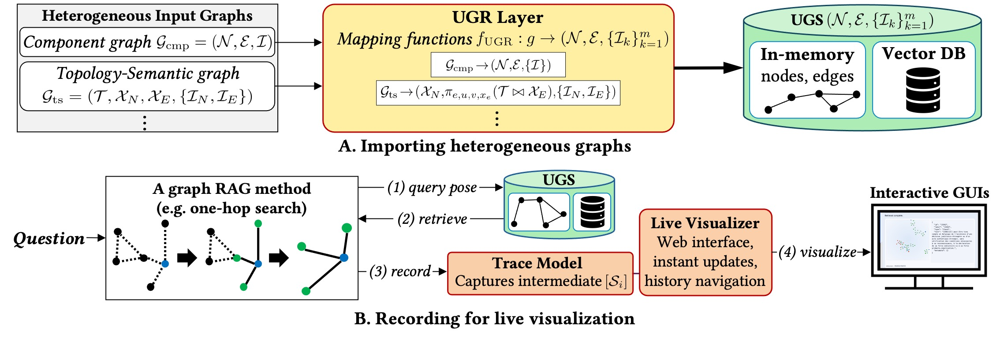

## GraphContainer

<p align="center">
  
</p>

**GraphContainer** provides a unified workflow for working with Graph-RAG systems. It is designed to load graphs produced by different methods, convert them into a shared internal representation, run retrieval pipelines on top of that representation, visualize retrieval traces in a browser, and execute experiments through a consistent interface.

A demonstration video is available at our Youtube demonstration: 
<a href="https://www.youtube.com/watch?v=OnaRT_icNM0" target="_blank">
  
</a>


### Overview

The main idea behind GraphContainer is simple: different Graph-RAG methods store graph data in different formats, but once those graphs are converted into a common structure, they can be searched, visualized, and compared in a much more consistent way. In this repository, that common structure is implemented through the graph container layer, which stores nodes, edges, adjacency information, and vector indexes in a form that downstream components can access without caring about the original source format.

At the core of the implementation are `SimpleGraphContainer` and `SearchableGraphContainer`. `SimpleGraphContainer` is responsible for holding the in-memory graph itself, while `SearchableGraphContainer` extends that base structure with pluggable vector indexes such as `node_vector`. On top of this container layer, the repository provides adapters for different upstream graph formats, including `import_graph_from_fastinsight`, `import_graph_from_lightrag`, and `import_graph_from_hipporag`. These adapters are the entry points that translate method-specific graph storage into the unified internal graph state used by the rest of the system.

Once a graph has been loaded, retrieval is handled by the RAG modules under `src/rag`. The embedding path is managed through `src/rag/embeddings.py`, and the retrieval logic lives in `src/rag/retrievers.py`. The repository currently includes two retrieval strategies: `OneHopRetriever`, which starts from vector-retrieved seed nodes and expands to their immediate neighbors, and `FastInsightRetriever`, which applies a multi-stage retrieval process with seed selection, deeper exploration, and final filtering. In the current experiment setup, the initial retrieval size is set to `10`, and FastInsight keeps the final `5` nodes before answer generation.

The end-to-end experiment pipeline is implemented in [test/rag_experiment.py](/./test/rag_experiment.py). This script loads the available graphs, applies the retrievers, builds prompts from the retrieved content, sends the prompts to the generator model, and writes the outputs as JSONL files. In other words, the implementation path is: load a graph from a method-specific source, convert it into the unified graph container, run retrieval on top of the shared representation, assemble the retrieved evidence into a prompt, generate an answer, and finally save the result for evaluation.

### Installation

Before running the project, make sure `uv` itself is installed. On macOS and Linux, you can install it with the official standalone installer:

```bash
curl -LsSf https://astral.sh/uv/install.sh | sh
```

On Windows PowerShell, you can install it with:

```powershell
powershell -ExecutionPolicy ByPass -c "irm https://astral.sh/uv/install.ps1 | iex"
```

If you prefer another installation method, such as Homebrew, WinGet, Scoop, or `pipx`, you can use the official `uv` installation guide. Once `uv` is available in your shell, install the project dependencies with:

```bash
uv sync
```

### Web-based Visualizer

The web interface is powered by the live visualizer. You can launch it directly from the command line by pointing it to a graph source:

```bash
uv run python -m GraphContainer.visualizer.live_visualizer \
  --source data/rag_storage/scifact-bge-m3 \
  --host 127.0.0.1 \
  --port 8765 \
  --hops 2
```

After the server starts, open `http://127.0.0.1:8765` in your browser. The page renders the graph or subgraph associated with the current retrieval session and lets you inspect how the retriever moved through the graph. Nodes and edges selected during retrieval can be highlighted, and the visualizer keeps track of session progress so that a query can be inspected step by step instead of only as a final result.

If you already have a graph object in memory, you can launch the same interface from Python by using `serve_graph`:

```python
from GraphContainer import serve_graph

visualizer = serve_graph(
    graph,
    host="127.0.0.1",
    port=8765,
    default_hops=2,
)

print(visualizer.url)
```

If your graph is stored in FastInsight format, you can also serve it directly from storage:

```python
from GraphContainer import serve_fastinsight

visualizer = serve_fastinsight(
    "data/rag_storage/scifact-bge-m3",
    host="127.0.0.1",
    port=8765,
    default_hops=2,
)
```

In practice, the web page is useful for understanding what happened during retrieval rather than only checking the final answer. A typical flow is to start the visualizer, open the browser page, submit a query or connect to an existing retrieval session, and then inspect the highlighted nodes, edges, and progress updates. This makes it easier to see which evidence was selected, how graph traversal expanded from the initial seeds, and how the retrieved subgraph contributed to the final answer.

### Run Experiments

The default experiment path in this repository is provided through [scripts/run_batch_experiment.sh](./scripts/run_batch_experiment.sh). This script is intentionally fixed to the current experimental setup and can be run with:

```bash
uv run bash scripts/run_batch_experiment.sh
```

By default, this runs the experiment on the `bsard` dataset with `query_limit=-1`, `top_k=10`, `index_name=node_vector`, `ollama_url=http://localhost:11434/v1`, `ollama_model=gemma3:12b`, and `max_context_chunks=10`. The current setup uses `text-embedding-3-small` for embeddings, and the experiment script iterates over the available graph imports while applying both retrieval methods to each graph.

If you want to run the experiment entry point directly rather than going through the batch script, you can execute:

```bash
uv run python test/rag_experiment.py \
  --dataset bsard \
  --query_limit -1 \
  --top_k 10 \
  --index_name node_vector \
  --output_dir ./output/bsard \
  --ollama_url http://localhost:11434/v1 \
  --ollama_model gemma3:12b \
  --max_context_chunks 10
```

The outputs are saved as JSONL files under `./output/bsard/`, typically in files named like `<graph_name>_<retriever>.jsonl`. Each line contains a single query-output pair in the form `{"query": "question text", "output": "generated answer"}`. This makes the results easy to evaluate later with a separate judging or comparison pipeline.
