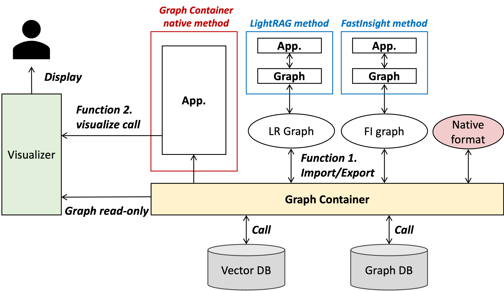

# GraphContainer + Live Visualizer Guide

This document explains how to use `GraphContainer` and its live web visualizer.



## 1. What You Get

- `SimpleGraphContainer`: in-memory graph (nodes, edges, adjacency).
- `SearchableGraphContainer`: `SimpleGraphContainer` + pluggable vector indexes.
- Adapters:
  - `import_graph_from_fastinsight(...)`
  - `import_graph_from_lightrag(...)`
- Live visualizer backend + web UI:
  - `LiveGraphVisualizer`
  - `serve_graph(...)`
  - `serve_fastinsight(...)`
  - `LiveVisualizerClient` (HTTP client for remote updates)

## 2. Prerequisites

- Python `>= 3.11`
- Install from project root:

```bash
pip install -e .
```

Optional packages for some adapter paths:
- `python-dotenv`, `numpy`, `ijson` (mainly for LightRAG import behavior/performance)

## 3. Basic Graph Usage

```python
from GraphContainer import SimpleGraphContainer, NodeRecord, EdgeRecord

graph = SimpleGraphContainer()

graph.add_node(NodeRecord(id="Doc:1", type="Document", text="A short document"))
graph.add_node(NodeRecord(id="Entity:OpenAI", type="Entity"))
graph.add_edge(
    EdgeRecord(
        source="Doc:1",
        target="Entity:OpenAI",
        relation="MENTIONS",
        weight=1.0,
    )
)

node = graph.get_node("Entity:OpenAI")
neighbors = graph.get_neighbors("Doc:1")  # outgoing edges from Doc:1
```

## 4. Save / Load

```python
from GraphContainer import SimpleGraphContainer

graph = SimpleGraphContainer()
# ... add nodes/edges ...
graph.save("data/my_graph")  # creates data/my_graph_nodes.parquet and _edges.parquet

loaded = SimpleGraphContainer()
loaded.load("data/my_graph")
```

## 5. Import from Existing RAG Stores

### FastInsight

```python
from GraphContainer import import_graph_from_fastinsight

graph = import_graph_from_fastinsight("data/rag_storage/scifact-bge-m3")
print(graph.list_indexes())  # often includes node_vector and collection name
```

Expected files under source directory:
- `nodes.jsonl`
- `edges.jsonl`
- optional `manifest.json`

### LightRAG

```python
from GraphContainer import import_graph_from_lightrag

graph = import_graph_from_lightrag("path/to/lightrag/output")
print(len(graph.nodes), len(graph.edges))
```

Expected files under source directory:
- `vdb_entities.json`
- `vdb_relationships.json`

Useful environment variables for LightRAG import:
- `LIGHTRAG_ATTACH_INDEX` (default: `true`)
- `LIGHTRAG_LOAD_EMBEDDINGS` (default: `true`)
- `LIGHTRAG_BATCH_SIZE` (default: `1000`)
- `VECTOR_STORE_PATH` (default: `./data/database/chroma_db`)
- `VECTOR_DISTANCE_METRIC` (default: `cosine`)

## 6. SearchableGraphContainer Example

```python
from GraphContainer import SearchableGraphContainer, InMemoryVectorIndexer

graph = SearchableGraphContainer()
indexer = InMemoryVectorIndexer()
graph.attach_index("node_vector", indexer)

indexer.add(
    "Doc:1",
    {
        "embedding": [0.1, 0.2, 0.3],
        "document": "A short document",
        "metadata": {"node_id": "Doc:1"},
    },
)

hits = graph.search("node_vector", [0.1, 0.2, 0.3], k=3)
print(hits)
```

## 7. Run the Live Visualizer

### Option A: Serve an existing graph object

```python
from GraphContainer import serve_graph

visualizer = serve_graph(
    graph,
    host="127.0.0.1",
    port=8765,
    default_hops=2,
)
print("Open:", visualizer.url)  # http://127.0.0.1:8765
```

### Option B: Serve directly from FastInsight storage

```python
from GraphContainer import serve_fastinsight

visualizer = serve_fastinsight(
    "data/rag_storage/scifact-bge-m3",
    host="127.0.0.1",
    port=8765,
    default_hops=2,
)
print("Open:", visualizer.url)
```

### Option C: CLI

```bash
python -m GraphContainer.visualizer.live_visualizer \
  --source data/rag_storage/scifact-bge-m3 \
  --host 127.0.0.1 \
  --port 8765 \
  --hops 2
```

## 8. Update Highlights During Runtime

`LiveGraphVisualizer` supports session-based highlighting (useful for live retrieval/debugging).

```python
session_id = visualizer.create_session({"query": "What is TopoRel?"})

visualizer.update_session(
    session_id,
    nodes=[
        {"id": "Entity:OpenAI", "style": {"color": {"background": "#ffd54f"}}},
    ],
    edges=[
        ("Doc:1", "Entity:OpenAI", "MENTIONS"),
    ],
    progress={"current": 1, "total": 3, "message": "retrieving..."},
)
```

When done:

```python
visualizer.stop()
```

## 9. Control Sessions Remotely (HTTP Client)

```python
from GraphContainer import LiveVisualizerClient

client = LiveVisualizerClient("http://127.0.0.1:8765")

session_id = client.create_session({"query": "graph search demo"})
client.set_progress(session_id, current=1, total=4, message="expanding neighbors")

client.update_session(
    session_id,
    nodes=[{"id": "Entity:OpenAI"}],
    edges=[{"source": "Doc:1", "target": "Entity:OpenAI", "relation": "MENTIONS"}],
)

subgraph = client.get_session_subgraph(session_id, hops=2)
print(subgraph["highlighted"])
```

## 10. Notes

- Highlighted node/edge IDs must exist in the base graph loaded in the visualizer.
- `get_neighbors(node_id)` returns outgoing edges.
- `PGVectorIndexer` exists as an interface but is not implemented yet.
